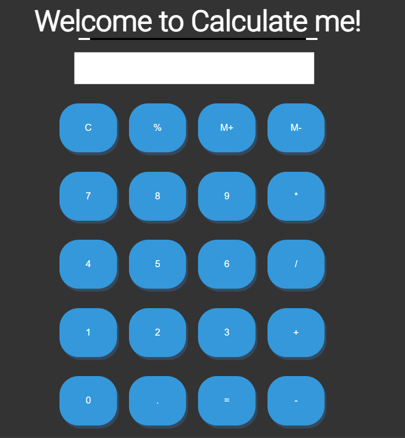

# Calculator JS Project



## Introduction

Welcome to the "Calculator JS Project"! This web-based calculator, built with HTML, CSS, and JavaScript, is a versatile tool for performing basic mathematical operations. It's designed with a focus on user experience, offering features such as addition, subtraction, multiplication, division, memory functions (M+ and M-), a screen-clearing option (C button), and more.

## Features

- **Responsive Design**: The calculator's responsive layout ensures it works seamlessly across various devices, including desktop and mobile.

- **Mathematical Operations**: Perform common mathematical operations like addition, subtraction, multiplication, and division with ease.

- **Memory Functions**: Store and retrieve numbers using the M+ and M- buttons, enabling you to work with multiple values.

- **Percentage and Decimal Point**: Quickly calculate percentages and utilize the decimal point for precision in your calculations.

- **Clear Screen**: Effortlessly clear the screen with the C button for a fresh start.

- **Equal Sign**: Easily display the result of your calculations with the equal sign.

## Demo

Explore the calculator in action:


## Usage

1. Open the calculator by visiting the project's [GitHub Pages](https://iMamoonAkhter.github.io/Calculator-JS-Project) or by cloning the repository and opening the `index.html` file in your web browser.

2. Input numbers by clicking the numeric buttons or using your keyboard.

3. Select mathematical operations (+, -, *, /) to perform calculations.

4. Utilize the M+ and M- buttons to store and recall numbers for more complex calculations.

5. Quickly clear the screen by clicking the C button.

6. Obtain your results with ease by clicking the equal sign.

## Installation

To run the calculator locally, follow these steps:

1. Clone this repository:
   ```shell
   git clone https://github.com/iMamoonAkhter/Calculator-JS-Project.git
